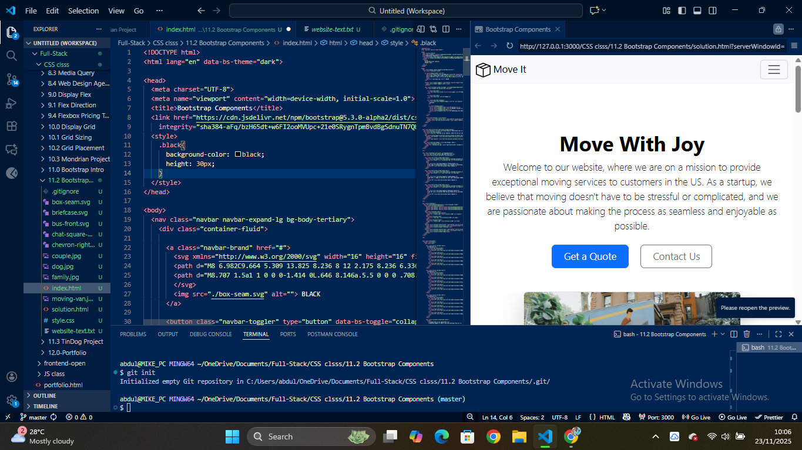
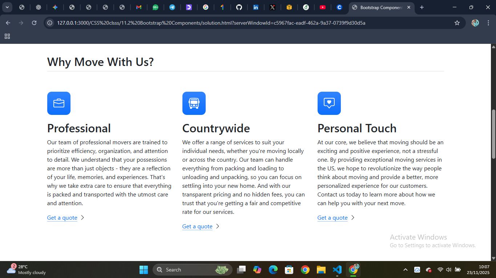
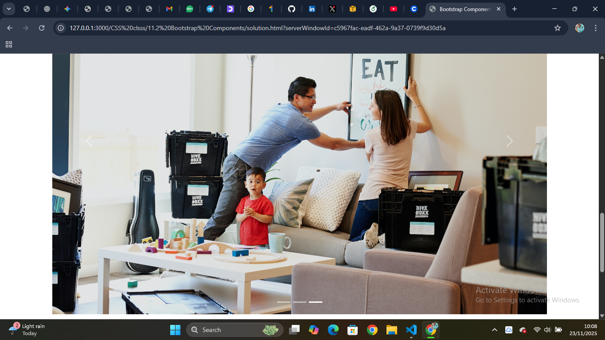
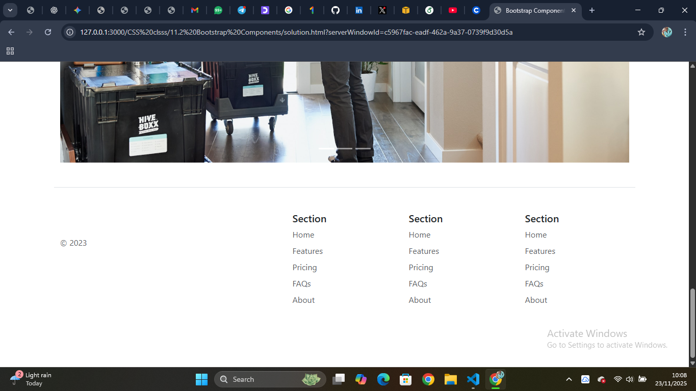

Bootstrap Components Project

This project is a simple practice build using Bootstrap 5 Components and Utilities.
The goal was to recreate a clean, responsive hero section similar to a modern startup landing page.

🚀 Features

Responsive navigation bar

Reusable Bootstrap buttons

Clean hero section layout

Bootstrap grid + utility classes

Light custom CSS for adjustments

Mobile-friendly out of the box

🛠️ Technologies Used

HTML5

CSS3

Bootstrap 5.3

VS Code + Live Server

📸 Screenshots
Hero Section

▶️ How to Run

Clone the repo:

git clone <your-repo-url>

Open the project folder

Launch index.html in your browser
or use Live Server in VS Code

📚 What I Learned

How Bootstrap’s component system works

How to customize Bootstrap with custom CSS

Using spacing, layout, and alignment utilities

Building responsive sections faster with minimal CSS

💡 Future Additions

Add more Bootstrap components

Create dark/light mode

Build a full multipage theme

⭐ Contributions

Feel free to fork this project and improve it.
